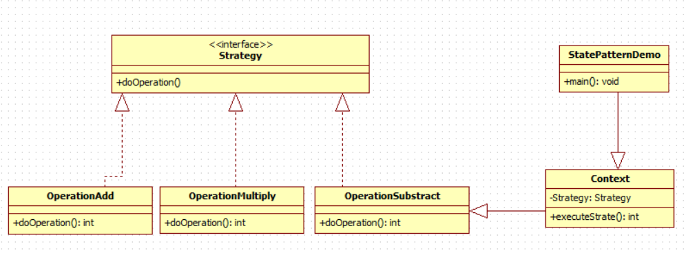

### **策略模式**

在策略模式中，一个类的行为或其算法可以在运行时更改。这种类型的设计模式属于行为模式。

**意图**：定义一系列的算法，把他们一个个封装起来，并且使他们可互换。

**主要解决：**在有很多中算法相似的情况下，使用**if...else**所带来的复杂和难以维护。

**何时使用：**一个系统有许多许多类，而区分他们的只是他们之间的行为。

**如何解决：**将这些算法封装成一个一个的类，任意地替换。

**关键代码：**实现同一个接口。

**优点：**1、算法可以自由切换。2、避免多重条件判断。3、扩展性好

**缺点：**1、策略类会增多。2、所有策略类都需要对外露

**使用场景：**1、如果在一个系统里面有许多类，它们之间的区别仅在于它们的行为，那么使用策略模式可以动态地让一个对象在许多行为中选择一种行为。2、一个系统需要动态地在几种算法中选择一种。3、如果一个对象有很多的行为，如果不用恰当的模式，这些行为就只好使用多重的条件选择语句来实现。

例子：我们将创建一个Strategy接口的实现策略类。Context是一个使用了某种策略的类。

StategyPatternDemo是测试类，类图如下：



**步骤1**

创建一个接口

```Java
public interface Strategy {
    public int doOperation(int num1,int num2);
}
```

**步骤2**

创建实现接口的实体类

```java
public class OperationAdd implements Strategy{
    @Override
    public int doOperation(int num1,int num2) {
        return num1+num2;
    }
}
```

```java
public class OperationMultiply implements Strategy{
    @Override
    public int doOperation(int num1, int num2) {
        return num1*num2;
    }
}
```

```java
public class OperationSubstract implements Strategy{
    @Override
    public int doOperation(int num1, int num2) {
        return num1-num2;
    }
}
```

**步骤3**

创建Context

```java
public class Context {
    private Strategy strategy;

    public Context(Strategy strategy) {
        this.strategy = strategy;
    }
    public int executeStrategy(int num1,int num2){
        return strategy.doOperation(num1,num2);
    }
}
```

**步骤4**

使用Context来查看当它改变策略Strategy时的行为变化

```java
public class StatePatternDemo {
    public static void main(String[] args) {
        Context context = new Context(new OperationAdd());
        System.out.println("10 + 5 = " + context.executeStrategy(10, 5));

        context = new Context(new OperationMultiply());
        System.out.println("10 * 5 = " + context.executeStrategy(10, 5));

        context = new Context(new OperationSubstract());
        System.out.println("10 - 5 = " + context.executeStrategy(10,5));
    }
}
```

